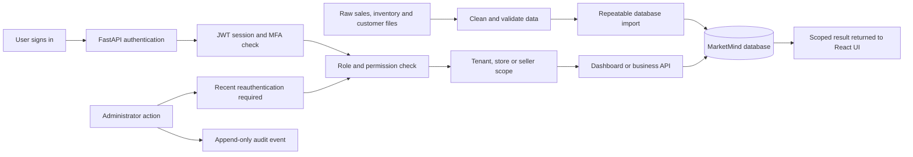

# MarketMind Milestone 1 Business Workflow

MarketMind gives a small business one controlled place to review sales, monitor inventory, manage
customer information, and administer staff access. The backend is the source of truth for every
permission and data boundary; hiding a frontend button is never treated as security.

## End-to-end workflow

## Operational workflows

### 1. Business onboarding and authentication

1. A Business Owner registers a business and its first store.
2. The account is activated through email verification.
3. A user signs in with an email address and password.
4. Administrators must also provide a valid TOTP MFA code.
5. FastAPI issues a short-lived access token and a rotating refresh token.
6. Every protected request validates the session, account state, tenant, role, and permissions.
7. Logout, password reset, role changes, and account disabling revoke affected sessions.

### 2. Dataset-to-database workflow

1. Sales, inventory, and customer source files are reviewed.
2. The preprocessing pipeline removes invalid records and creates cleaned Milestone 1 files.
3. Alembic applies the required database structure.
4. The import command upserts products, inventory, transactions, and customer summaries.
5. Stable business keys prevent duplicates when the same import is run again.
6. Dashboard KPIs and operational APIs read the imported database records.

### 3. Sales workflow

1. A user opens a role-scoped sales dashboard.
2. The Business Owner sees tenant-wide sales, a Store Manager sees the assigned store, and a Sales
   Executive sees only personally owned sales.
3. Date filters are sent to the dashboard API and calculated against completed transactions.
4. Store Managers and Sales Executives can create transactions inside their allowed scope.
5. Store Managers can update or void store transactions; Sales Executives can update only their
   own transactions.
6. Business Owners have read-only operational access in Milestone 1.
7. Administrators can perform permitted actions across their tenant after MFA verification.

### 4. Inventory workflow

1. Imported product and inventory records are stored per tenant and store.
2. Business Owners can review inventory across the business.
3. Store Managers can review and update stock for their assigned store.
4. Sales Executives do not receive inventory access.
5. Low-stock and out-of-stock counts are calculated from database records.
6. Purchase orders, supplier integration, and shipment integration are labelled as planned work.

### 5. Customer workflow

1. Cleaned customer summaries are imported into the database.
2. Business Owners can view tenant-wide customer records.
3. Store Managers receive operational customer summary access.
4. Sales Executives receive only customers assigned to them.
5. Administrators receive tenant-wide access after MFA verification.

### 6. User administration workflow

1. An Administrator signs in with password and MFA.
2. The Administrator re-enters credentials to receive a short-lived reauthentication token.
3. The token is required to invite users, change roles, or enable and disable accounts.
4. Store Managers and Sales Executives must be assigned to a store.
5. Role or account-state changes revoke the affected user's existing sessions.
6. The action is written to the audit trail with actor, target, time, and change details.

## Four-role mapping

| Role | Business responsibility | Data scope | Milestone 1 dashboard | Main allowed actions | Main restrictions |
|---|---|---|---|---|---|
| Business Owner | Review overall business performance and make strategic decisions | Entire tenant | Business-wide sales KPIs, revenue trend, inventory analytics, and customer records | Read all tenant sales, inventory, and customers; filter and drill into business data | Cannot manage users, change stock, create or edit sales, or read audit events |
| Store Manager | Run day-to-day operations for one assigned store | Assigned store | Store sales, inventory counts, stock alerts, and customer summary | Create sales; read and update store sales; void store sales; update store inventory | Cannot access another store, manage users or roles, or view the security audit trail |
| Sales Executive | Record and track personal selling activity | Own sales and assigned customers | Personal revenue, transaction count, targets, and assigned customer context | Create sales in assigned store; read and update own transactions; view assigned customers | Cannot see another seller's transactions, manage inventory, void sales, or administer users |
| Administrator | Manage security, identities, configuration, and platform oversight | Entire tenant, still tenant-isolated | Administration, tenant-wide operational data, users, roles, security, and audit | Full permission catalog; invite and manage users; change roles; read audit events | MFA is mandatory; sensitive changes also require recent reauthentication; no cross-tenant bypass |

## Security boundaries

- Every protected API requires a Bearer access token.
- Permission dependencies use a deny-by-default policy.
- Business data is always filtered by tenant.
- Store Manager access is restricted to the assigned store.
- Sales Executive access is restricted to owned transactions and assigned customers.
- Administrator permissions do not remove tenant isolation.
- Frontend navigation reflects access returned by `GET /api/v1/dashboard/access`.
- Cross-scope records return `403 Forbidden` or a scope-safe `404 Not Found`.

## Milestone boundary

Authentication, RBAC, sales, inventory, customers, dashboard KPIs, user administration, audit,
database migrations, and repeatable imports are implemented in Milestone 1. AI forecasting, churn
prediction, recommendations, downloadable reports, supplier workflows, purchase orders, shipments,
and production monitoring are planned for later milestones.
